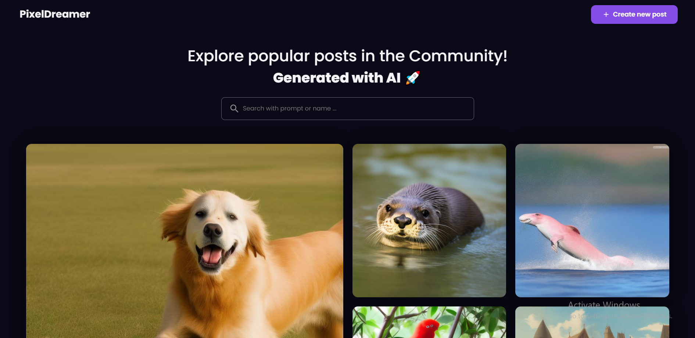

PixelDreamer 🎨
An AI-Powered Image Generation Platform

Description
PixelDreamer is a full-stack web application that allows users to generate unique images using AI-powered text prompts. Users can also share their creations with a community and explore posts from others. Built with modern technologies, this app showcases the power of AI in creative applications.

Features ✨
AI Image Generation: Generate stunning images using Hugging Face’s Stable Diffusion model by simply entering a text prompt.

Community Gallery: Share your AI-generated images with a prompt and author name, and explore posts from other users.

Responsive Design: A clean and intuitive user interface built with React.js and Styled Components.

Cloud Integration: Images are securely stored and managed using Cloudinary.

Real-Time Updates: The gallery dynamically updates with new posts, creating an engaging community experience.

Tech Stack 💻
Frontend
React.js: For building the user interface.

Styled Components: For styling and theming.

Material-UI: For pre-built UI components like buttons and loaders.

React Router: For navigation between pages.

Backend
Node.js: For the server-side logic.

Express.js: For building RESTful APIs.

MongoDB: For storing post data (e.g., prompts, author names, and image URLs).

Cloudinary: For image storage and management.

AI Integration
Hugging Face API: For generating images using the Stable Diffusion model.

Other Tools
Axios: For making HTTP requests.

Dotenv: For managing environment variables.

Usage 🚀
Generate an Image:

Go to the Create Post page.

Enter a detailed prompt and click Generate Image.

Once the image is generated, you can share it with the community.

Explore the Community Gallery:

Visit the Home page to see posts from other users.

Click on any image to view it in full size.

Future Plans 🔮
Add user authentication to allow users to create accounts and save their posts.

Implement an upvoting system for community posts.

Add advanced search filters to the gallery (e.g., search by prompt or author).

Improve the AI model for faster and higher-quality image generation.